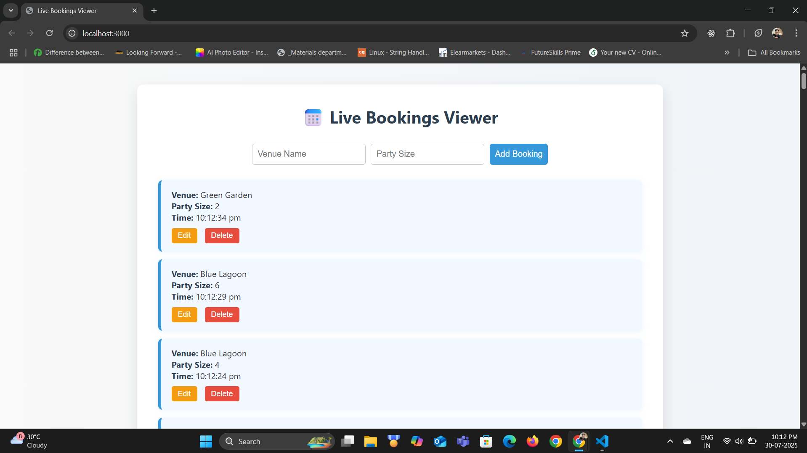

# 📅 Live Bookings Viewer

A real-time full-stack web application to display and manage live booking updates for venue administrators.

---

## 💻 Tech Stack

- **Backend**: Node.js, Express.js, Socket.IO
- **Frontend**: HTML, CSS, Vanilla JavaScript
- **Real-time Communication**: Socket.IO (WebSocket)
- **Data Storage**: In-memory array (mock & dynamic data)

---

## 🚀 Features

- 🔄 Real-time booking updates every 5 seconds
- 💬 WebSocket-based communication for live changes
- ➕ Create, ✏️ update, and 🗑️ delete bookings
- 🎨 Responsive and modern UI (HTML + CSS only)
- ❌ No frontend frameworks (React, Tailwind, etc.)

---

## 📂 Project Structure

live-bookings-viewer/
├── client/
│ ├── index.html # Main frontend UI
│ ├── style.css # Styles
│ └── app.js # JS logic (sockets + fetch)
├── server/
│ ├── controllers/ # Request logic
│ ├── routes/ # API routing
│ ├── services/ # Service layer
│ ├── server.js # Main backend entry
│ └── .env # Environment config
└── README.md # Project documentation


---

## ⚙️ Getting Started

### 1️⃣ Clone the Repository

```bash
git clone https://github.com/Sunil-Sahoo-2004/live-bookings-viewer.git
cd live-bookings-viewer
```

### 2. Setup Backend

```bash
cd server
npm install
```

Create a .env file in /server:

```ini
PORT=5000
```

Run the backend server:

```bash
npm run server
```

### 3. Run Frontend

Open the client/index.html file using Live Server or use:

```bash
npx serve client
```

Then open your browser at: http://localhost:3000 or the Live Server port.
Or, open client/index.html using Live Server (VSCode Extension).

## 🔐 Environment Variables

| Key   | Value                     |
|-------|---------------------------|
| PORT  | Backend server port (e.g., 5000) |

> ⚠️ Do **not** commit the `.env` file. Add it to `.gitignore` to keep it secure.

---

## 📷 Screenshots

### 🖼️ Home Page (Live View)
 

---

## 📦 API Endpoints

| Method | Endpoint         | Description           |
|--------|------------------|-----------------------|
| GET    | `/`              | Server health check   |
| POST   | `/bookings`      | Create a new booking  |
| PUT    | `/bookings/:id`  | Update a booking      |
| DELETE | `/bookings/:id`  | Delete a booking      |

> All endpoints respond with `JSON` and are CORS-enabled.

---

## 📜 License

This project is licensed under the [MIT License](./LICENSE).

---

## 🙌 Author

Made with ❤️ by [Sunil Sahoo](https://github.com/Sunil-Sahoo-2004)