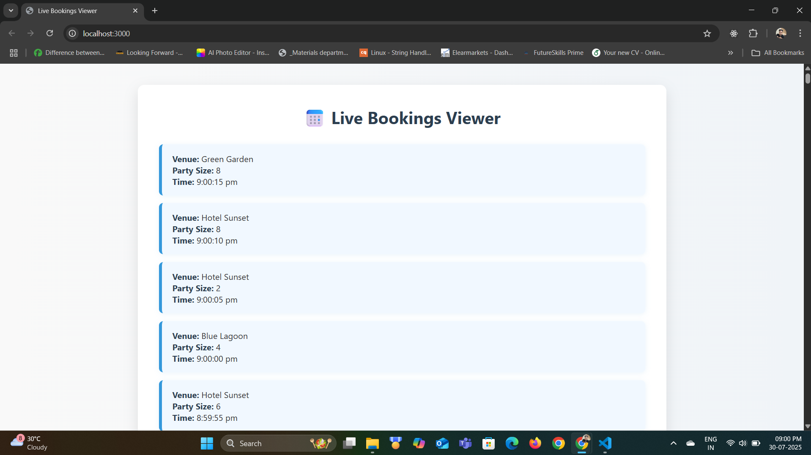

# 📅 Live Bookings Viewer

A real-time full-stack web application to display live booking updates for venue administrators.

---

## 💻 Tech Stack

- **Backend**: Node.js, Express.js, Socket.IO
- **Frontend**: HTML, CSS, Vanilla JavaScript
- **Realtime Communication**: Socket.IO
- **Data Storage**: In-memory array (mock data generator)

---

## 🚀 Features

- Real-time booking updates every 5 seconds.
- Stylish and responsive UI.
- Bookings appear at the top of the list instantly via WebSocket.
- Pure HTML, CSS & JS (No frameworks like React/Tailwind).

---

## 📂 Project Structure

live-bookings-viewer/ <br>
├── server/ <br>
│ ├── server.js <br>
│ └── .env <br>
├── client/ <br>
│ ├── index.html <br>
│ ├── style.css <br>
│ └── app.js <br>
└── README.md <br>

---

## ⚙️ Getting Started

### 1. Clone the Repository

```bash
git clone https://github.com/Sunil-Sahoo-2004/live-bookings-viewer.git
cd live-bookings-viewer
```

### 2. Setup Backend

```bash
cd server
npm install
```

Create a .env file in /server:

```ini
PORT=3000
```

Run the backend server:

```bash
npm run server
```

### 3. Run Frontend

Open the client/index.html file using Live Server or use:

```bash
npx serve client
```

Then open your browser at: http://localhost:3000 or the Live Server port.

## 🖼️ Screenshot



---

## 📃 License

This project is licensed under the [MIT License](LICENSE).
